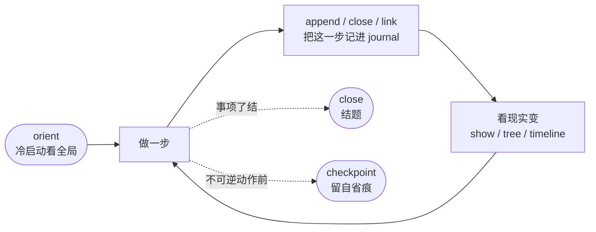
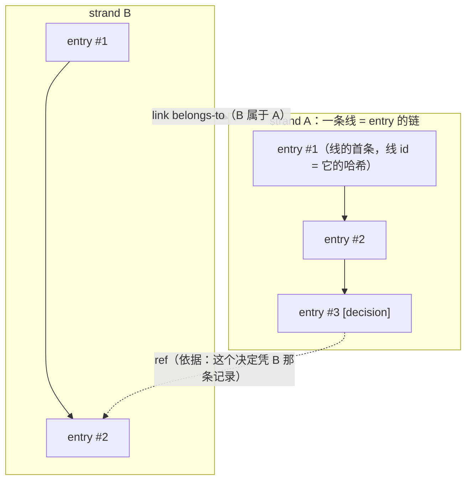
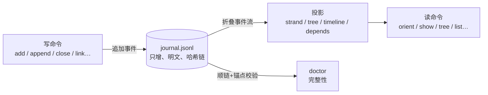
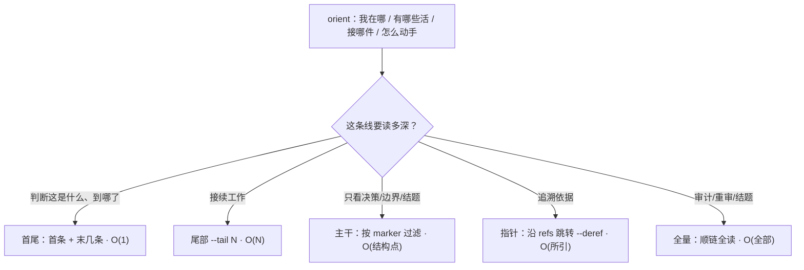

# tasktree

**给 LLM agent 用的、可跨会话的持久工作记忆。** 一个本地 Rust CLI:所有改动以事件形式追加进一份只增的 journal,每次读取都从事件流重新投影出视图——历史不可改,视图随需重建。

> 场景:LLM agent 承担跨会话的长期工作。进程随时可能终止,后继进程没有记忆,journal 是向后继传递工作历史的唯一介质。

职责划分只有一条:**机器负责记录与检索,不做语义解释;理解由读取时在场的 LLM 完成。**

- 概念模型(为什么这么设计)见 [docs/CORPUS.md](docs/CORPUS.md)
- 代码的模块结构见 [docs/ARCHITECTURE.md](docs/ARCHITECTURE.md)

---

## 它解决什么问题

一个 agent 干长期活,会遇到三件事,普通做法都处理不好:

| 问题 | 常见做法 | 毛病 | tasktree |
|---|---|---|---|
| 进程死了,记忆没了 | 塞进上下文窗口 | 装不下、带不走 | 外置成只增 journal,后继者读得回 |
| "当前状态"文档 | 维护一份 summary | 写完即过期、成第二真相源 | 不做摘要,靠生命周期折叠(关闭的线整批退出视图) |
| "这个判断凭什么" | 散文里写"如前所述" | 事后只能全文检索猜 | 写入时打 `--why`,读取时一条命令展开依据链 |

核心的一句话契约:**每一种结构化读取路径,对应写入时的一个结构化承诺。** 机器不理解内容,无法事后补建结构——写入时没标 `[decision]`,之后就没法按决策过滤,只能全文重读。所以工具的价值,是让"写清楚"这件事在写入时几乎零成本,读取时大幅省力。

---

## 工作循环

tasktree 的命令按一个循环组织:做一步 → 看现实怎么变 → 再想下一步。



---

## 一分钟上手

```bash
# 构建(需要 Rust)
cargo build --release          # 产物在 target/release/tasktree

# 在项目目录初始化 journal（发现方式和 .git 一样，向上查找 .tasktree/）
tasktree init

# 冷启动：每次会话开始跑一次，看"我在哪、有哪些活、接哪件、怎么动手"
tasktree orient

# 开一条新线（正文走 stdin，不走命令行参数）
echo "[task] 实现 X 功能" | tasktree add

# 往某条线追加一条记录
echo "[decision] 采用方案 B，比 A 简单" | tasktree append --id <ID>

# 引用依据：--why 指向支撑这条判断的记录（线前缀=其最新条，或 entry 哈希前缀=精确那条）
echo "[decision] 放弃方案 A" | tasktree append --id <ID> --why <REF>

# 事项了结时关闭（关闭的线整批退出 orient 视图，冷启动更干净）
tasktree close --id <ID> --as done

# 读：分层下钻，先首尾再尾部再全文
tasktree show --id <ID> --digest      # 一眼：marker 分布，不倒全文
tasktree show --id <ID> --tail 8      # 尾部：接续工作
tasktree show --entry <HASH> --deref 1  # 沿 refs 展开依据链，带机械坐标
```

写入统一走 **stdin**——正文经命令行参数会被 shell 的引号、`$`、连字符搞坏,stdin 内容原样到达。旗标携带结构(`--id`/`--why`),stdin 携带正文。

---

## 核心概念

系统里只有一个对象:**entry**(一条记录)。其余都是它的组合。



- **entry**:一条记录。九个字段分四层——元数据(时间戳、前驱、offset、作者、id)、结构承诺(marker、refs)、内容(正文)、状态变更(effect)。写入成本不因此增加:元数据全自动,marker 一个词,refs 与 effect 可选。
- **strand(线)**:entry 的链。**线的 id 就是它首条 entry 的哈希**——线不是先建好的容器,是从首条记录延伸出来的链。
- **link**:表达**线与线**的关系,供机器算投影。两种:`belongs-to`(归属,递归成树)、`depends-on`(依赖,算就绪/阻塞)。
- **ref**:表达**记录与记录**的依据,供读者追溯。就像论文引用——写新记录时附上所依据旧记录的地址(内容哈希),读取时按哈希取回原文。

**marker vs effect**——同一条 entry 上两个标签,受众相反:

| | marker | effect |
|---|---|---|
| 面向 | 未来的 LLM(读) | 机器(算状态) |
| 词表 | 开放,作者随意扩展(`[decision]`/`[friction]`/`[metric]`…) | 封闭,机器必须理解(close/link/hide/reopen…) |
| 作用 | 显示与过滤 | **改变线的状态** |

分立是为了:一个供人读、可自由取值,一个供机器算、必须受控。混用会让随手写下的一个词意外改动线的状态。

---

## 只增 + 投影:核心架构

durable 的东西只有一样——那份只增的事件流。任何从它算出来的东西都是投影,必须能从 journal 重建。



两个直接后果:

- **丢了投影不丢信息**——投影随时能从 journal 重算;摘要文档做不到这点(它是与原始记录并存的第二真相源),所以 tasktree 不做摘要,靠关闭线来折叠冷启动成本。
- **改坏任何一条记录,其后全部 id 失效**——防篡改从"靠纪律"变成"可校验",doctor 顺链验一遍即可定位断点。

---

## 读:分层下钻,不默认全量

历史会增长,冷启动全量读取的成本也随之增长。对策是分层——先看便宜的,读完再决定要不要进下一层:



升级顺序:首尾 → 尾部或主干 → 指针 → 全量。工具负责收窄范围(`--tail`/`--under`/`--since-offset`)与投影;字段塑形交给 `jq`(JSON 输出是公开契约)。

---

## 完整性:靠结构,不靠检查

保证一条规矩成立有两种办法:事后派检查器查(允许违规先发生再报),或让违规在结构上无法存在。哈希链把一批完整性规矩挪到了后者:

- **顺序**焊在 id 里(每条 id 含上一条),重排即断链,顺序不可能乱;
- **身份**是定义(线 id = 首条哈希),不可能不匹配;
- **防篡改**:改一条其后全失效,验一遍链即知。

机器还会周期性写入**锚点事件**(当前全部线头哈希的清单+摘要),给整个 journal 一个可单点比对的状态校验和。`tasktree doctor journal` 顺链+锚点重算一遍。

而像 ref 失效、归属指向已关母线这种,是**需要被看见的事实,不是需要被杜绝的缺陷**——doctor 把它们摆出来,是否据此改结论由 LLM 判断。doctor 是证人,写判决的是 LLM。

---

## 边界

- **一个 journal 对应一个项目。** 发现方式与 .git 相同(向上查找 `.tasktree/`)。
- **单写者(单机)。** 同机多 agent 由文件锁串行化(接力写一部),多机不共享锁则不可合并。
- **没有主 journal。** 一份 journal 属于动手实践、记录它的那个人;fork 后代码同源、journal 分家,各记各的。跨库只有只读参考和按哈希引用,不接着别人的链写、不合并。
- **明文 JSONL。** 工具二进制缺失时,`cat`/`grep`/`jq` 仍可读全部历史——记录的存活期必须长于工具。
- **纳入 git 是显式决策。** 收益是 clone 即备份、为哈希提供外部锚定;代价是可见性(journal 随仓库公开)。

---

## 命令一览

```
看   orient  show  list  timeline  search  find  tree  depends
做   add  append  close  reopen  checkpoint  link  unlink  bind
管   init  hide  unhide  doctor  export  explain  cutover-v2
```

能力沿 `tasktree --help` → 子命令 `--help` → `tasktree explain <topic|CODE>` 逐阶发现。契约(参数与输出)见 `tasktree explain grammar`。

---

## 进一步阅读

| 文档 | 讲什么 |
|---|---|
| [docs/CORPUS.md](docs/CORPUS.md) | 目标概念模型:为什么 entry 是唯一实体、哈希链身份、link/ref 两层关系、靠生命周期折叠、读写契约 |
| [docs/ARCHITECTURE.md](docs/ARCHITECTURE.md) | 当前代码的四模块结构:Journal Core / Projection Core / Contract Surface / CLI Adapter,及其依赖方向与不变量 |
| [docs/MIGRATION-v1-to-v2.md](docs/MIGRATION-v1-to-v2.md) | v1→v2 journal 迁移(`cutover-v2`)操作指南 |

---

## 开发

```bash
cargo build --release && cargo test --release   # 全绿才算完
```

工程纪律:JSON 输出字段只增不改不删(公开契约,规则见 `src/output.rs` 头注);help 文本里的示例命令会被 CI 真解析——改 help 必须保证示例可解析。
