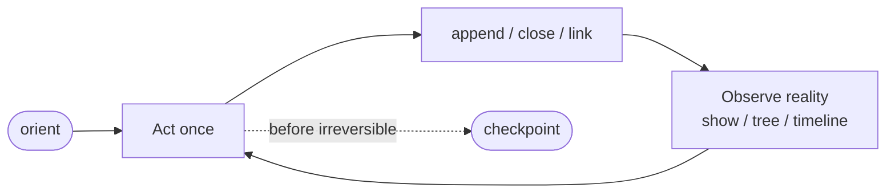
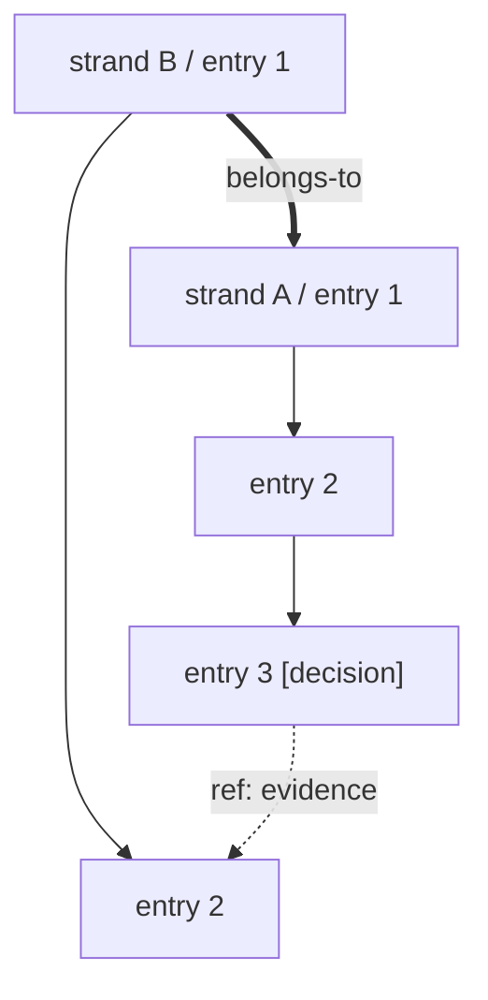

# mnema

English | [简体中文](README.zh-CN.md)

**An append-only semantic topology for durable human and multi-agent work.**

mnema is a local Rust CLI. It records facts as immutable journal events and
replays them into strands, structural ancestry, review relationships, evidence
references, lifecycle, and recursive scopes. Models and process harnesses may
change; successors can still recover and continue the semantic topology.

> Journal is the virtual root. Any strand can become a local root. A top-level
> session sees JournalScope; a delegated worker enters through its own
> SubtreeScope and does not implicitly absorb unrelated trees.

Core boundary: **the machine records and retrieves structure; interpretation
belongs to the human or LLM reading it.**

## Why mnema

| Problem | Common workaround | Failure mode | mnema |
|---|---|---|---|
| An agent exits and loses working memory | Keep everything in context | Context is bounded and non-portable | Append facts to a replayable journal |
| A “current state” summary drifts | Maintain another document | It becomes a second truth source | Close finished strands; replay lifecycle |
| A decision loses its evidence | Write “as discussed above” | Later readers must search and guess | Attach entry-level refs when writing |

The central contract is:

> Every structured read path corresponds to a structured promise made at write time.

mnema does not infer structure from prose after the fact. If a decision matters
as a decision, write it with a marker; if evidence matters, attach a ref.

## One-minute start

```bash
cargo build --release
mnema init

# Session entry from the virtual Journal root
mnema orient

# Delegated entry from a local subtree root
mnema orient --id <ID>

# Entry content always comes from stdin
echo "[task] implement X" | mnema add
echo "[decision] choose B" | mnema append --id <ID>
echo "[decision] reject A" | mnema append --id <ID> --ref <REF>

# Finish lifecycle explicitly
mnema close --id <ID> --as done

# Read progressively
mnema show --id <ID> --digest
mnema show --id <ID> --tail 8
mnema show --entry <HASH> --deref 1
```

Flags carry structure (`--id`, `--parent`, `--ref`); stdin carries entry
content unchanged by shell argument parsing.

## Work loop



## Semantic model

The only durable primitive is an **entry**. Everything else is a projection.

- **entry** — one immutable log record with automatic metadata, optional marker,
  refs, provenance, and effect.
- **strand** — an entry chain; its id is the hash of its first entry.
- **belongs-to link** — CHILD → PARENT structural membership; recursively forms a tree.
- **depends-on link** — TASK → UPSTREAM review context; never a readiness gate.
- **ref** — ENTRY → ENTRY evidence/source citation; does not expand scope.
- **effect** — closed machine vocabulary for lifecycle and structural changes.
- **marker** — open annotation vocabulary for future readers.



## Append-only journal and projections

The active v3 journal is plain JSONL with a hash chain and periodic anchors.
Strands, trees, timelines, scopes, and lifecycle are reproducible projections.
Deleting a disposable projection cannot delete journal facts; changing a
historical record invalidates downstream identities and is detected by
`mnema doctor journal`.

## Progressive reads

Read only as deeply as the decision requires:

1. `orient` — global/local entry and active work.
2. `show --digest` — identity, lifecycle, marker census.
3. `show --tail N` — recent continuation window.
4. `show --entry HASH --deref N` — evidence chain.
5. Full `show` — audit or reconsideration.
6. `timeline --since-offset N` — incremental journal changes.

Use `--under <ID>` for SubtreeScope collection queries. Parent, refs, and
depends-on remain explicit unexpanded exits unless requested.

## Boundaries

- One journal represents one project semantic topology.
- Multiple local writers serialize append operations with file locks.
- Multi-machine merging is not silently treated as safe.
- Worktrees resolve to the project journal; independent forks own independent journals.
- Journal content is plaintext. Do not store credentials or secrets.
- Tracking `.mnema/` in Git is an explicit visibility and backup decision.

## Command discovery

```text
mnema --help
mnema <command> --help
mnema explain grammar
mnema explain <topic|CODE>
```

Top-level commands:

```text
orient show list timeline search find pick tree depends
add append checkpoint close reopen link unlink
init hide unhide doctor export cutover-v2 cutover-v3 explain
```

JSON output is a public compatibility contract: fields may be added, but
existing fields are not renamed, removed, or redefined.

## Documentation

Start with [the English documentation map](docs/README.en.md).

- [Architecture](docs/ARCHITECTURE.md)
- [Domain semantics](docs/CORPUS.md)
- [Diagnostics](docs/DIAGNOSTICS.md)
- [Testing policy](docs/TESTING.md)
- [Test catalog](docs/TEST-CATALOG.md)

The core documents are currently Chinese-first; paired English translations
will land incrementally. CLI syntax, JSON contracts, and diagnostic codes remain
the machine-readable authority.

## Development

```bash
cargo build --release
cargo test --release
```

Help examples are parsed by tests. Public JSON compatibility rules are documented
at the top of `src/output.rs`.

## License

Dual-licensed under your choice of:

- [Apache License 2.0](LICENSE-APACHE)
- [MIT License](LICENSE-MIT)
