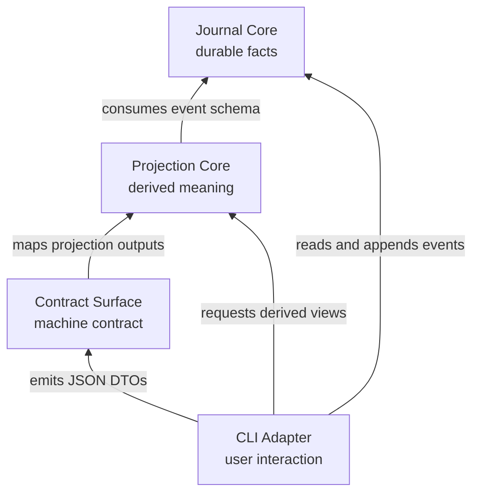
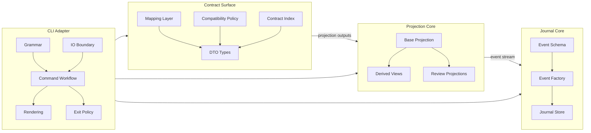

# ARCHITECTURE: mnema-core

## Overview

mnema is a local Rust CLI for durable work memory. All durable changes are appended as events to a journal; every read path obtains views reproducible from that event stream. A disposable verified cache may accelerate replay, but never becomes a second source of truth.

The target architecture has four modules. Dependencies point outward from durable facts to derived views to public contracts to CLI orchestration.

概念模型与 v2 演化方向（entry 统一实体、哈希链身份、link/ref 两层关系、生命周期折叠、stdin 单通道）见 [CORPUS.md](CORPUS.md)。本文档只管当前代码的模块结构。

## Modules

Journal Core owns durable facts. It defines the event schema, constructs valid events, and persists the append-only journal. It hides event construction, journal discovery, locking, lossy/strict reads, ID/timestamp/append_id generation, provenance/git metadata capture, and append mechanics. Its interface to the rest of the system is an event stream with journal offsets.

Journal Core also owns the replay-cache boundary. A cache may retain validated replay state, the canonical event view, heads, and general entry indexes. It is versioned and bound to journal identity, byte length, content digest, and the covered anchor. Cache loss, corruption, mismatch, or an unsupported version causes strict replay; cache update failure cannot turn a successful journal append into a failed durable write. The cache does not store command DTOs, rendered text, or scope-specific answers.

Projection Core owns derived meaning. It folds event streams into read models such as strands, timelines, graphs, trees, context slices, and audit findings. Base Projection mechanically folds events into current read state; Derived Views organize read use cases; Review Projections emit findings and evidence for agent/human review. Projection Core consumes events, does not own the event schema, does not write the journal, and does not decide process exit behavior.

Scope is a Projection Core concept. `JournalScope` addresses the whole journal; `Subtree(root)` addresses the named strand and every descendant reachable through `belongs-to`. The rule is recursive and independent of delegation depth: a first-order worker and a tenth-order worker use the same `Subtree(root)` operation with different roots. Other strands remain discoverable by explicit search or references, but are not expanded into the scoped view by default. Upstream context is exposed as one or more refs/relations plus retrieval commands, never as generated summaries.

Contract Surface owns the public machine-readable contract. It maps projection outputs into JSON DTOs and defines field names, compatibility fields, deprecated-but-preserved fields, and the local contract index exposed to users. DTOs are external contract, not internal projection models.

CLI Adapter owns user interaction and orchestration. It parses CLI grammar, resolves input sources, builds command requests, runs command workflows, calls core modules, renders human-readable text, emits JSON through the Contract Surface, and maps outcomes to exit codes. It is allowed to be wide, but it must stay shallow: it coordinates core behavior rather than owning event schema, projection folds, DTO compatibility, or audit generation.

Human reference resolution belongs at this CLI boundary. User-facing handles such as unique hash prefixes, slugs, `@last`, `@1`/`@2`, and picker selections are parsed before command workflows call the core modules. The resolver reads the canonical full strand projection, including hidden and closed strands, to prove uniqueness, then returns canonical strand ids to the workflow. Graph/tree/depends code must not own a second resolver with different ambiguity semantics. The resolver must not create a second durable source of truth for strand identity.

## Boundaries

Durable facts end at the append-only journal. Anything computed from the journal is a projection and must be reproducible from journal events.

Replay caches are disposable Journal Core accelerators, not durable facts. A cache hit must prove that its version and journal binding match before returning cached state; otherwise the reader performs strict replay. `doctor` never accepts a cache as evidence of journal integrity and always performs full canonical validation.

Journal Core owns the event schema and event construction. Projection Core may consume events but must not introduce a second source of durable fact.

Projection Core functions take event streams plus explicit request parameters and return projection outputs. They do not read journal paths, write journal events, print, parse CLI grammar, know JSON field names, or return exit codes.

Scoped orientation is built on one generic Scope/Projection API, not separate top-level, worker, and nested-worker implementations. Top-level `orient` requests `JournalScope`; delegated orientation requests `Subtree(root)`. Prompt wording and visible fields may differ by scope, but traversal, lifecycle, visibility, reference, and ambiguity semantics remain shared.

Only general replay facts may be cached before the Scope API stabilizes. Cached subtree results, scoped counters, or other query-specific indexes are introduced only behind the Projection API after their semantics are fixed; CLI output DTOs are never cache schemas.

Contract Surface maps projection outputs to DTOs. It may map and preserve compatibility fields, but nontrivial computation belongs in Projection Core. CLI code may select a DTO, but it must not reshape public JSON ad hoc.

CLI grammar, help text, text rendering, and exit-code policy do not define durable facts. They may call core modules, but Journal Core and Projection Core do not depend on CLI syntax or stdout/stderr behavior.

Slug durability and selection cache state have different ownership. A slug is a human alias for a strand and must be represented in the journal/projection path if it is meant to survive clone, backup, and later sessions. By contrast, `@last` and `@1`/`@2` are CLI-local selection caches under `.mnema/`: they are directory-level shared state, not per-agent cursors, so concurrent writers may overwrite them. They are allowed to be stale, missing, or corrupt, and consumers must fail closed instead of guessing. Projection Core must not consume the selection cache.

Audit findings are projections. The audit pass derives findings from events; diagnostic catalog/explain output belongs to the public contract surface; command-specific presentation and exit behavior belong to the CLI Adapter.

Diagnostics keep no cross-run state. The doctor pass rebuilds every health fact from the current journal on each run; it does not persist a prior-run state file to diff against. Only integrity and parse failures fail the command — every other finding is surfaced as advisory, never blocking.

## Conventions

Complex commands use request/outcome types between parsed CLI arguments and rendering. Parsed CLI arguments are not core requests.

JSON output fields are compatibility commitments: fields may be added, but existing field names and meanings are not renamed, removed, or silently repurposed.

Deprecated JSON fields stay in DTOs and contract documentation. They must not force internal projection models to keep obsolete concepts as primary design.

Human-readable text is CLI behavior, not the machine contract. Help examples are parse-contracts and must remain executable; other text output may evolve without changing JSON DTO semantics.

The picker is a human-only interactive projection at the CLI Adapter. `pick` renders the same strand projection the machine reads as JSON, but folded and navigable — a built-in arrow-key menu (`inquire`) is the default backend, and `fzf` is an optional accelerator that adds a live preview pane when present. Selection is read from the controlling terminal, never from stdin, so a piped body stays free: `pick append` selects interactively but takes the entry body from stdin (never from the terminal), and close/reopen take their optional reason the same way. The TTY guard therefore keys on terminal availability, not on stdin being a terminal, since a piped body deliberately makes stdin a non-terminal. In non-TTY contexts the picker fails closed with a usage error, never blocking. No feature may require the picker as its only entry point, and the picker is a presentation of the projection, not a second source of truth for strand identity or content.

Review projections report facts and evidence. They do not decide whether a task is valid, whether an agent should stop, or whether a process exits successfully.

## Invariants

The journal is append-only: commands record new events rather than mutating or deleting historical events.

Read models are projections: losing a projection must not lose durable information, because the projection can be rebuilt from the journal.

Deleting every replay or projection cache changes performance only; it does not change command results, journal validity, strand identity, or relation semantics.

Delegation depth is not journal state and does not change scope semantics. Every delegated agent is oriented from a strand root using the same recursive subtree rule.

JSON DTO shape is public contract: changing existing field names or meanings is a breaking change.

Inner modules do not depend on outward concerns: Journal Core does not depend on Projection Core, Contract Surface, or CLI Adapter; Projection Core does not depend on Contract Surface or CLI Adapter; Contract Surface does not depend on CLI Adapter.

## Key decisions

Use append-only journal plus projections as the core architecture. The journal records durable facts; projections let read behavior evolve without rewriting history.

Keep the architecture at four modules: Journal Core, Projection Core, Contract Surface, and CLI Adapter. The event schema stays inside Journal Core as the durable fact interface exposed to projections; it does not become a separate fifth module unless multiple storage or transport backends make that split necessary.

Keep DTOs separate from internal projection models. Scripts and agents consume JSON output as a stable contract, while internal read models can change behind that boundary.

Treat audit diagnostics as read-side projections. Findings are derived from events; command-specific presentation and exit behavior remain outside Projection Core.

Keep diagnostics stateless. The doctor command derives its findings from the current journal each run instead of caching a prior-run state file, so there is no second store that can drift from the journal. This is the same rule as the projection invariant applied to the diagnostic path: the journal is the only durable fact, everything else is recomputed.

Define recursive orientation before query-specific caching. The stable dependency order is Scope semantics, generic Projection API, then command rendering and optional scope indexes. In parallel, Journal Core may implement a general verified replay cache because it contains no orient DTO or depth-specific result. Integration tests merge the replay cache before measuring recursive orient so performance does not silently determine semantics.
