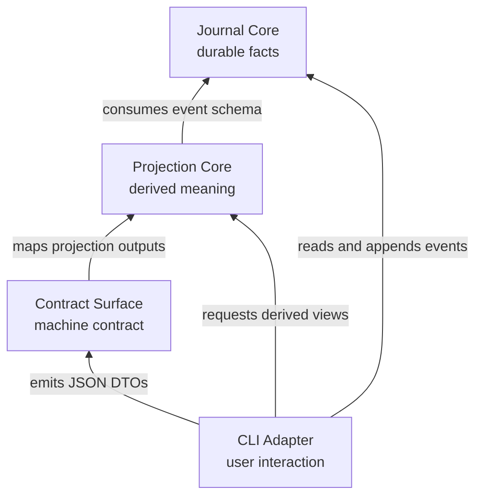
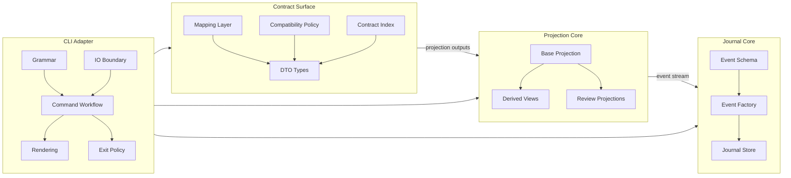

# ARCHITECTURE: tasktree-core

## Overview

tasktree is a local Rust CLI for durable work memory. All durable changes are appended as events to a journal; every read path rebuilds derived views from that event stream instead of treating cached state as source of truth.

The target architecture has four modules. Dependencies point outward from durable facts to derived views to public contracts to CLI orchestration.

概念模型与 v2 演化方向（entry 统一实体、哈希链身份、link/ref 两层关系、生命周期折叠、stdin 单通道）见 [CORPUS.md](CORPUS.md)。本文档只管当前代码的模块结构。

## Modules

Journal Core owns durable facts. It defines the event schema, constructs valid events, and persists the append-only journal. It hides event construction, journal discovery, locking, lossy/strict reads, ID/timestamp/append_id generation, provenance/git metadata capture, and append mechanics. Its interface to the rest of the system is an event stream with journal offsets.

Projection Core owns derived meaning. It folds event streams into read models such as strands, timelines, graphs, trees, context slices, and audit findings. Base Projection mechanically folds events into current read state; Derived Views organize read use cases; Review Projections emit findings and evidence for agent/human review. Projection Core consumes events, does not own the event schema, does not write the journal, and does not decide process exit behavior.

Contract Surface owns the public machine-readable contract. It maps projection outputs into JSON DTOs and defines field names, compatibility fields, deprecated-but-preserved fields, and the local contract index exposed to users. DTOs are external contract, not internal projection models.

CLI Adapter owns user interaction and orchestration. It parses CLI grammar, resolves input sources, builds command requests, runs command workflows, calls core modules, renders human-readable text, emits JSON through the Contract Surface, and maps outcomes to exit codes. It is allowed to be wide, but it must stay shallow: it coordinates core behavior rather than owning event schema, projection folds, DTO compatibility, or audit generation.

## Boundaries

Durable facts end at the append-only journal. Anything computed from the journal is a projection and must be reproducible from journal events.

Journal Core owns the event schema and event construction. Projection Core may consume events but must not introduce a second source of durable fact.

Projection Core functions take event streams plus explicit request parameters and return projection outputs. They do not read journal paths, write journal events, print, parse CLI grammar, know JSON field names, or return exit codes.

Contract Surface maps projection outputs to DTOs. It may map and preserve compatibility fields, but nontrivial computation belongs in Projection Core. CLI code may select a DTO, but it must not reshape public JSON ad hoc.

CLI grammar, help text, text rendering, and exit-code policy do not define durable facts. They may call core modules, but Journal Core and Projection Core do not depend on CLI syntax or stdout/stderr behavior.

Audit findings are projections. The audit pass derives findings from events; diagnostic catalog/explain output belongs to the public contract surface; command-specific presentation and exit behavior belong to the CLI Adapter.

Diagnostics keep no cross-run state. The doctor pass rebuilds every health fact from the current journal on each run; it does not persist a prior-run state file to diff against. Only integrity and parse failures fail the command — every other finding is surfaced as advisory, never blocking.

## Conventions

Complex commands use request/outcome types between parsed CLI arguments and rendering. Parsed CLI arguments are not core requests.

JSON output fields are compatibility commitments: fields may be added, but existing field names and meanings are not renamed, removed, or silently repurposed.

Deprecated JSON fields stay in DTOs and contract documentation. They must not force internal projection models to keep obsolete concepts as primary design.

Human-readable text is CLI behavior, not the machine contract. Help examples are parse-contracts and must remain executable; other text output may evolve without changing JSON DTO semantics.

Review projections report facts and evidence. They do not decide whether a task is valid, whether an agent should stop, or whether a process exits successfully.

## Invariants

The journal is append-only: commands record new events rather than mutating or deleting historical events.

Read models are projections: losing a projection must not lose durable information, because the projection can be rebuilt from the journal.

JSON DTO shape is public contract: changing existing field names or meanings is a breaking change.

Inner modules do not depend on outward concerns: Journal Core does not depend on Projection Core, Contract Surface, or CLI Adapter; Projection Core does not depend on Contract Surface or CLI Adapter; Contract Surface does not depend on CLI Adapter.

## Key decisions

Use append-only journal plus projections as the core architecture. The journal records durable facts; projections let read behavior evolve without rewriting history.

Keep the architecture at four modules: Journal Core, Projection Core, Contract Surface, and CLI Adapter. The event schema stays inside Journal Core as the durable fact interface exposed to projections; it does not become a separate fifth module unless multiple storage or transport backends make that split necessary.

Keep DTOs separate from internal projection models. Scripts and agents consume JSON output as a stable contract, while internal read models can change behind that boundary.

Treat audit diagnostics as read-side projections. Findings are derived from events; command-specific presentation and exit behavior remain outside Projection Core.

Keep diagnostics stateless. The doctor command derives its findings from the current journal each run instead of caching a prior-run state file, so there is no second store that can drift from the journal. This is the same rule as the projection invariant applied to the diagnostic path: the journal is the only durable fact, everything else is recomputed.
